<!--more-->
安装系统证书配合青花瓷采用模拟器挂载vpn方式进行抓包

```
windows
burpsuite
夜神模拟器 Android7.0以上
Charles
postern
```

## Charles
```
下载地址 https://www.charlesproxy.com/latest-release/download.do
激活码计算 https://www.zzzmode.com/mytools/charles/
```

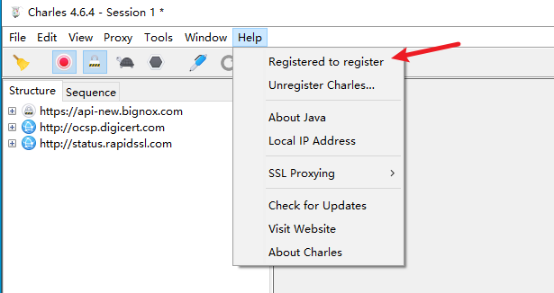

### 导入系统级证书

生成pem证书后进行转换

[https://www.cnblogs.com/YenKoc/p/14376653.html](https://www.cnblogs.com/YenKoc/p/14376653.html)

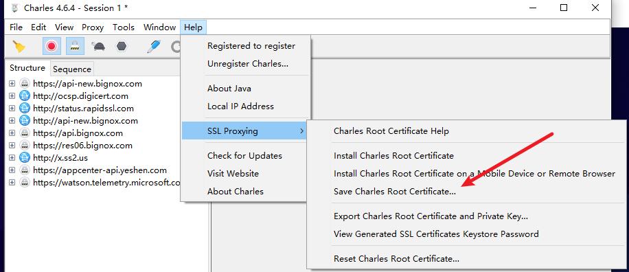

```
生成charles对应系统证书

计算文件名
openssl x509 -subject_hash_old -in charles.pem

将文件更改未对应文件名后缀为.0的文件
mv charles.pem 2f81fb0b.0


生成burp对应系统证书
openssl x509 -inform DER -outform PEM -text -in burp.der -out burp.pem
openssl x509 -subject_hash_old -in burp.pem
mv burp.pem 9a5ba575.0
```

### 使用模拟器自带adb进行调试
```
nox_adb.exe devices 	
模拟器开启后查看已链接设备

nox_adb.exe push 2f81fb0b.0 /data/local/tmp
nox_adb.exe push 9a5ba575.0 /data/local/tmp
复制证书文件到模拟器内部目录

nox_adb.exe root
以root权限运行

nox_adb.exe shell
进入交互式shell


mount -o rw,remount -t auto /system
将系统的根目录（/system）以可读写（rw）的方式重新挂载（remount）。其中，-o选项用于指定挂载选项，rw表示可读写，-t选项用于指定文件系统类型，auto表示自动检测文件系统类型

cp 9a5ba575.0  /system/etc/security/cacerts/
cp 2f81fb0b.0  /system/etc/security/cacerts/
拷贝文件到系统证书路径下

reboot
重启

检查证书系统下是否存在charles证书
```


## burp导入Charles的证书

### 导出charles p12证书
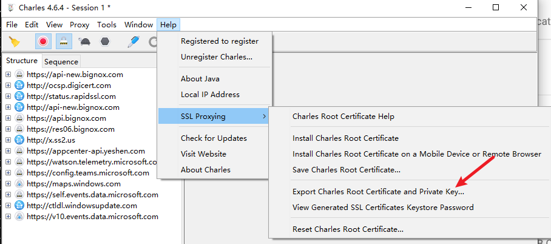


### burp导入证书
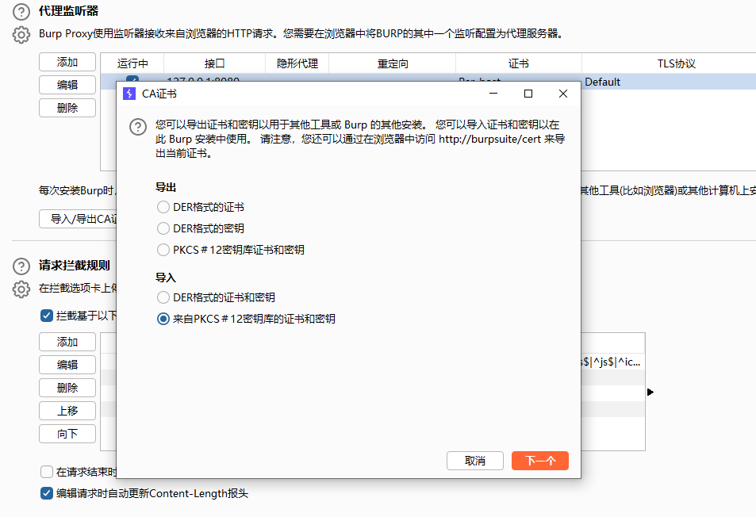


## charles 代理设置
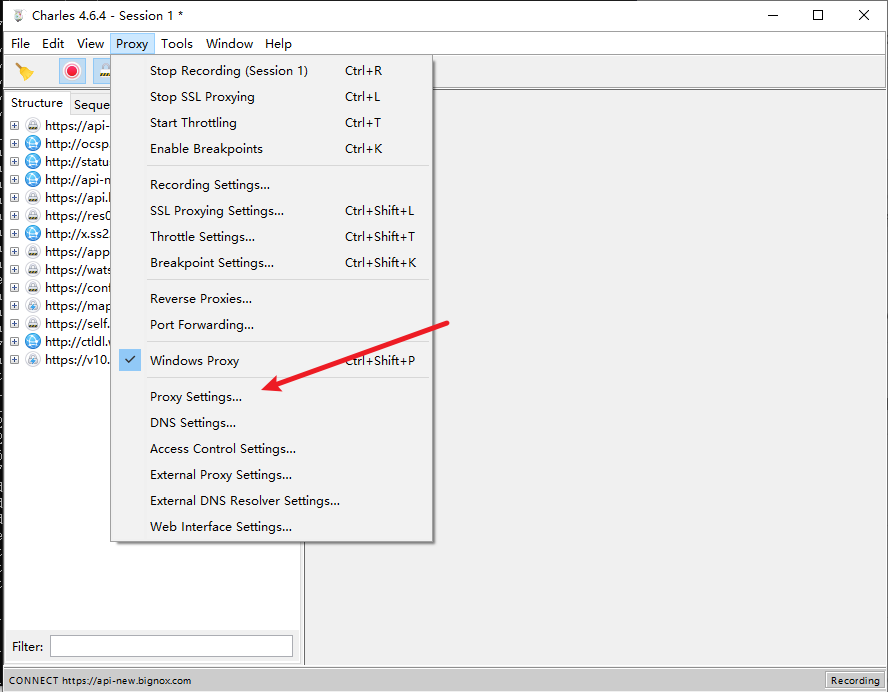

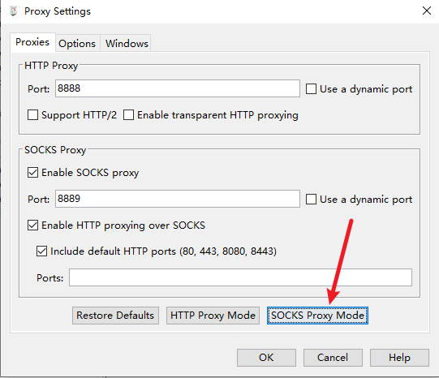

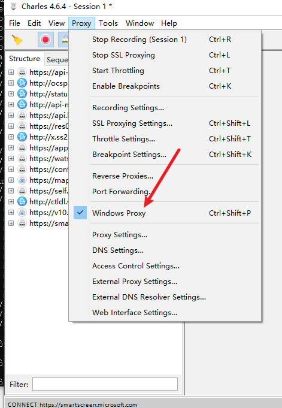

取消勾选windows proxy，不需要抓取windows数据，按需选取。

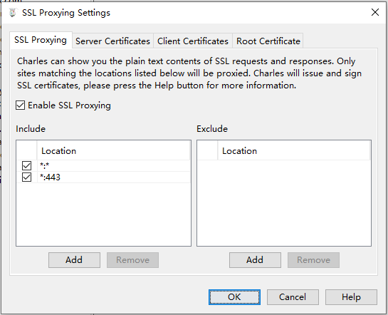

添加ssl proxy


-----------------------------------------------------------

## Postern
```
外置代理工具

常规配置指向charles 8889 socks端口，修改规则走向charles
```


-----------------------------------------------------------

## 雷电模拟器安装证书

### 开启root权限

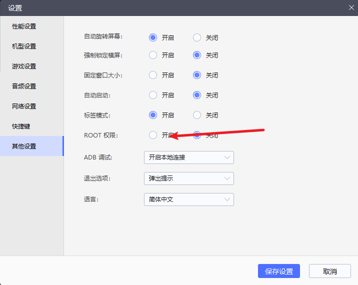

### 开启system目录可写入

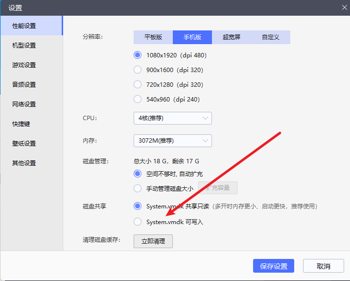


```
复制文件到模拟器目录
adb.exe push 2f81fb0b.0 /data/local/tmp

开启root
adb.exe root

重新挂载系统目录使得可写入
adb.exe remount

adb.exe shell

cd /data/local/tmp

cp 2f81fb0b.0 /system/etc/security/cacerts/2f81fb0b.0

reboot
```

可见系统证书

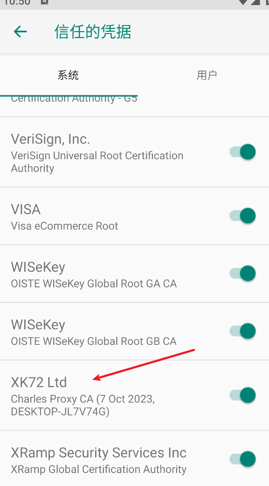


## 参考链接

[https://www.xsssql.com/article/26.html](https://www.xsssql.com/article/26.html)


