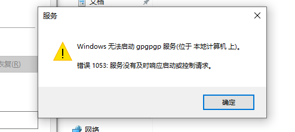

# 创建自定义服务启动遇到1053错误


<!--more-->
创建服务程序运行指定程序解决1053错误

在做权限维持或者使用sc创建服务来启动恶意程序时通常会遇到"错误1053：服务没有及时响应启动或控制请求"，除开依赖项、系统资源问题之外。该错误一般为将一个非服务程序指定为服务的 binPath 时，系统会尝试以服务的方式来启动该程序。如果该程序不符合服务的要求，比如缺少必要的服务特权或无法接收服务控制管理器的请求，就会导致错误 1053。作为服务程序需要按照Windows 服务的规范编写，必须要继承ServiceBase类。



当使用sc创建并启动执行程序为cs上线程序服务时，往往会看到确实上线了但过了一会就会出现掉线情况就是因为该程序不是服务程序，没有被windwos服务而管控导致停止服务。

## 运行指定程序

c#代码
```
using System;
using System.Diagnostics;
using System.ServiceProcess;

namespace MyService
{
    public class MyService : ServiceBase
    {
        static void Main()
        {
            ServiceBase.Run(new MyService());
        }

        public MyService()
        {
            this.ServiceName = "MyService";
        }

        protected override void OnStart(string[] args)
        {
            ExecuteVlogCommand();
        }

        private void ExecuteVlogCommand()
        {
            ProcessStartInfo psi = new ProcessStartInfo(@"C:\exe.exe");
            psi.UseShellExecute = false;

            Process process = Process.Start(psi);
            process.WaitForExit();
        }
    }
}
```

该代码可以使用.net自带得csc.exe进行编译为可执行文件。
