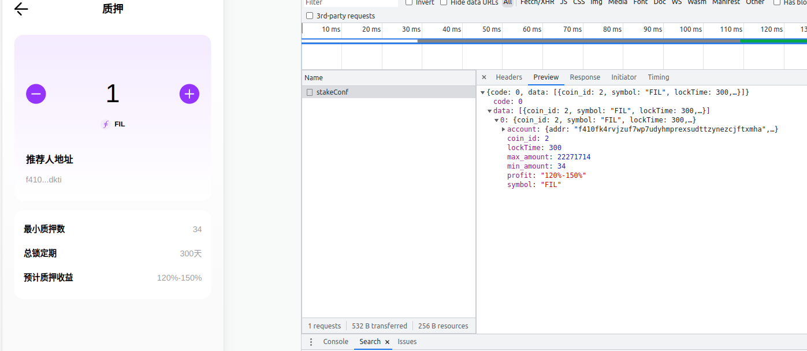
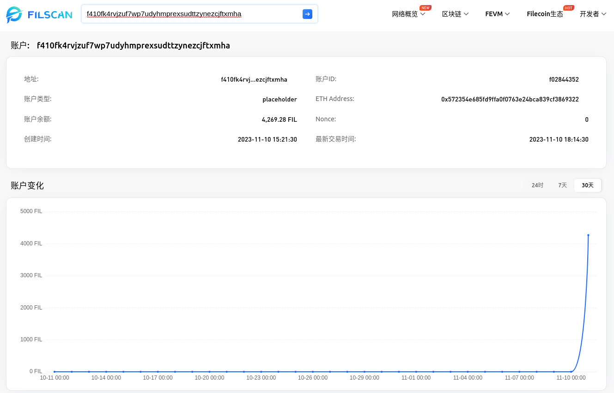
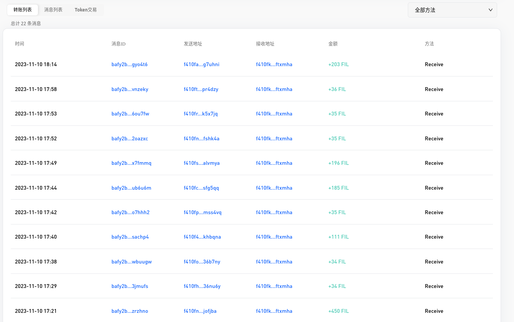

# fildao.io分析

## 站点分析

fildao.io 是一个允许用户通过质押 FIL 代币来获取奖励的平台。FIL 是 Filecoin 链的原生代币。用户可以在 fildao.io 上进行 FIL 代币的质押，并获得相应的质押奖励。此外，用户还可以通过邀请下级用户进行质押，从而获得团队奖励和推荐奖励。平台内设有 VIP 等级，根据质押数量划分不同的 VIP 等级，具体的升级方式和奖励情况尚未在平台内部进行详细说明。

## 模式分析

经分析发现，平台内的质押并非由合约控制，而是通过将 FIL 代币发送到平台提供的指定 Filecoin 钱包地址进行转账。质押奖励的计算、质押赎回以及提现等操作都在中心化平台内执行并审核，整个过程中并没有出现合约交互。

20231110平台内提供的质押地址

该地址创建时间为2023-11-10 15:21:30,创建时间根据第一笔收款记录生成。

通过分析平台内的充值和首页排行榜的用户地址，发现用户进行充值或质押后，平台会定期汇总充值和质押地址的余额。最终追溯到地址 f410fctzshm4b5262b7ujeowvhz7eekscu6nt7tqwy2i（ETH地址格式：0x14f323b381eebda0fe8923ad53e7e422a42a79b3），该地址当前持有 430,146.0179 FIL。